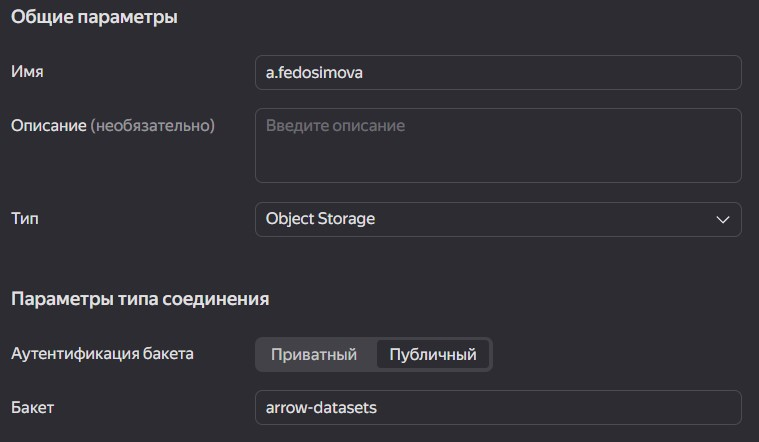
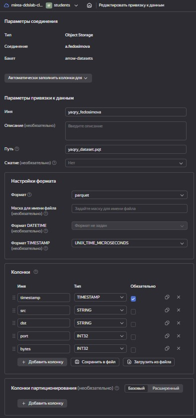
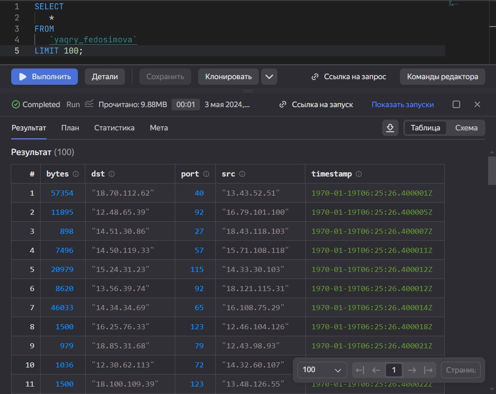
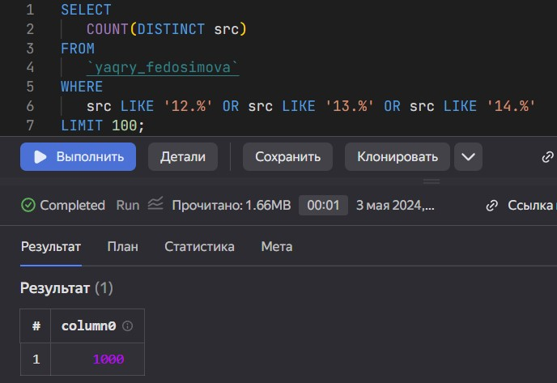
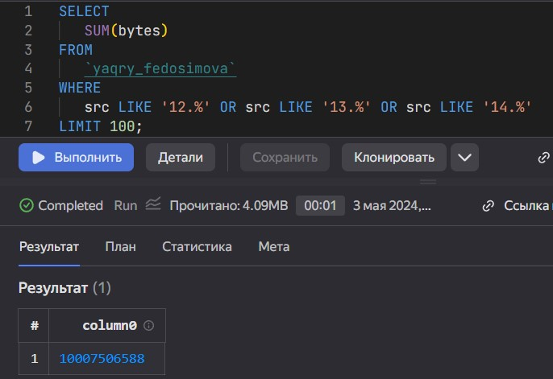
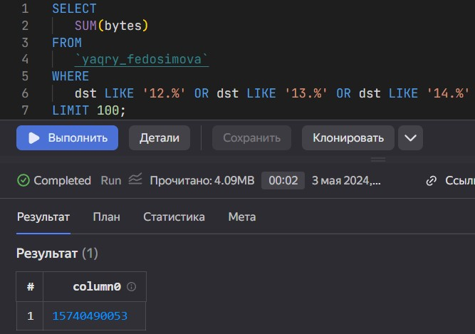

# P3_1_YaQuery
Федосимова Александра Дмитриевна

Использование технологии Yandex Query для анализа данных сетевой
активности

## Цель работы

1.  Изучить возможности технологии Yandex Query для анализа
    структурированных наборов данных
2.  Получить навыки построения аналитического пайплайна для анализа
    данных с помощью сервисов Yandex Cloud
3.  Закрепить практические навыки использования SQL для анализа данных
    сетевой активности в сегментированной корпоративной сети

## Исходные данные

1.  Ноутбук с ОС Windows 10
2.  RStudio
3.  Yandex Cloud
4.  Yandex Query

## Задание

Используя сервис Yandex Query настроить доступ к данным, хранящимся в
сервисе хранения данных Yandex Object Storage. При помощи
соответствующих SQL запросов ответить на вопросы.

### 1. Проверить доступность данных в Yandex Object Storage

https://storage.yandexcloud.net/arrow-datasets/yaqry_dataset.pqt

### 2. Подключить бакет как источник данных для Yandex Query

Для этого нужно зайти в Yandex Query -\> Соединения -\> Создать

Далее нужно заполнить поля с учетом допустимых символов, выбрать тип
аутентификации – публичный. Ввести имя бакета в соответствующее поле и
сохранить.

<figure>

<figcaption aria-hidden="true">Storage Yandex Cloud</figcaption>
</figure>

Теперь, после создания соединения, нужно указать, какой объект
использовать в качестве источника данных. Для этого нужно сделать
привязку данных.

<figure>

<figcaption aria-hidden="true">Storage Yandex Cloud</figcaption>
</figure>

Формат входных данных:

    SCHEMA=(
    timestamp TIMESTAMP NOT NULL,
    src STRING,
    dst STRING,
    port INT32,
    bytes INT32
    )

Если настройки сделаны правильно, то запрос покажет таблицу.

<figure>

<figcaption aria-hidden="true">Storage Yandex Cloud</figcaption>
</figure>

## Провести анализ данных

### 1. Известно, что IP адреса внутренней сети начинаются с октетов, принадлежащих интервалу \[12-14\]. Определите количество хостов внутренней сети, представленных в датасете.

<figure>

<figcaption aria-hidden="true">Storage Yandex Cloud</figcaption>
</figure>

    SELECT
       COUNT(DISTINCT src)
    FROM
       `yaqry_fedosimova`
    WHERE
       src LIKE '12.%' OR src LIKE '13.%' OR src LIKE '14.%' 
    LIMIT 100;

`1000`

### 2. Определите суммарный объем исходящего трафика

<figure>

<figcaption aria-hidden="true">Storage Yandex Cloud</figcaption>
</figure>

    SELECT
       SUM(bytes)
    FROM
       `yaqry_fedosimova`
    WHERE
       src LIKE '12.%' OR src LIKE '13.%' OR src LIKE '14.%' 
    LIMIT 100;

`10007506588`

### 3. Определите суммарный объем входящего трафика

<figure>

<figcaption aria-hidden="true">Storage Yandex Cloud</figcaption>
</figure>

    SELECT
       SUM(bytes)
    FROM
       `yaqry_fedosimova`
    WHERE
       dst LIKE '12.%' OR dst LIKE '13.%' OR dst LIKE '14.%' 
    LIMIT 100;

`15740490053`

## Оценка результатов

Был проведен анализ сетевой активности с помощью SQL и Yandex Cloud.

## Вывод

Была осуществлена работа с системой Yandex Cloud и сервисами внутри неё.

``` r
sprintf("Практическая работа 1 завершена")
```

    [1] "Практическая работа 1 завершена"
