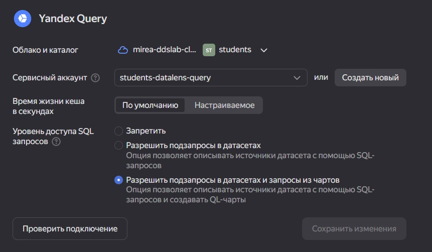
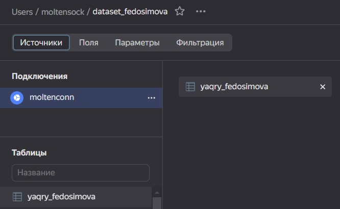
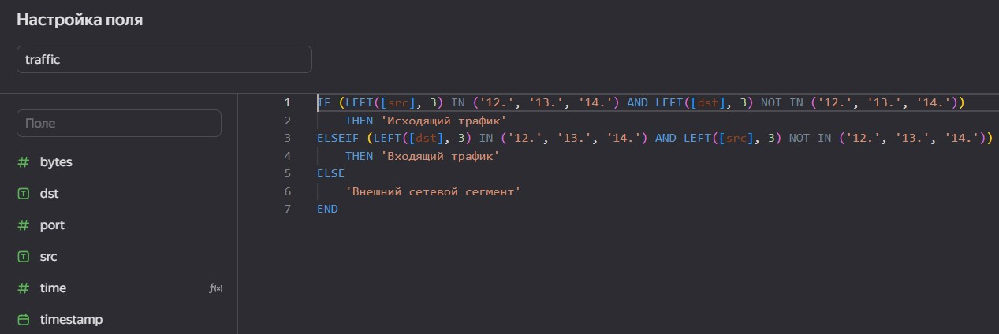
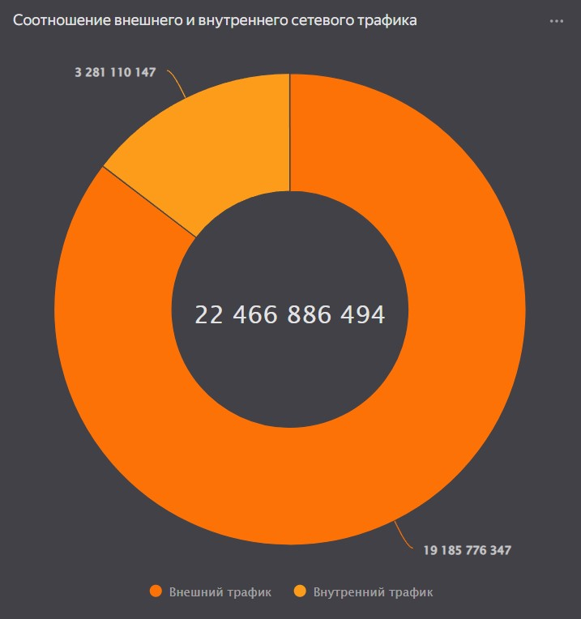
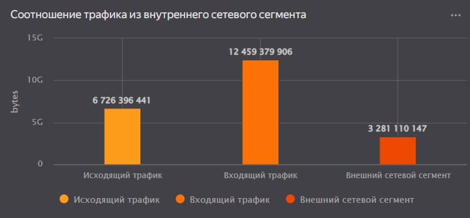
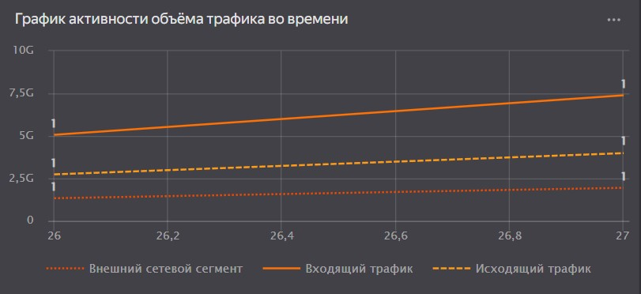
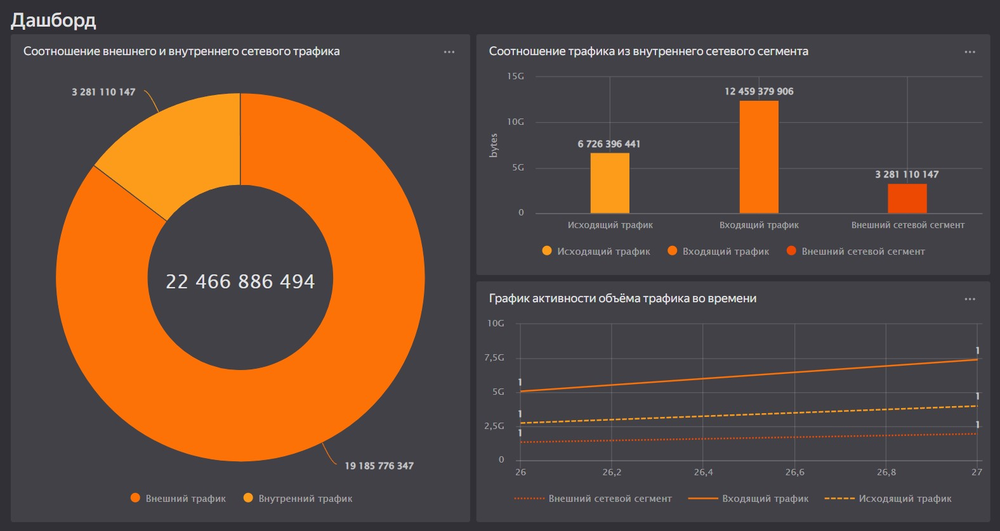

# lab2
Федосимова Александра Дмитриевна

Использование технологии Yandex DataLens для анализа данных сетевой
активности

    https://datalens.yandex.cloud/s99s5nmaip8og-dashbord

## Цель

1.  Изучить возможности технологии Yandex DataLens для визуального
    анализа структурированных наборов данных
2.  Получить навыки визуализации данных для последующего анализа с
    помощью сервисов Yandex Cloud
3.  Получить навыки создания решений мониторинга/SIEM на базе облачных
    продуктов и открытых программных решений
4.  Закрепить практические навыки использования SQL для анализа данных
    сетевой активности в сегментированной корпоративной сети

## Исходные данные

1.  Ноутбук с ОС Windows 10
2.  RStudio
3.  Yandex Cloud
4.  Yandex DataLens

## Задание

Используя сервис Yandex DataLens настроить доступ к результатам Yandex
Query, полученным в ходе выполнения практической работы №1, и визуально
представить результаты анализа данных.

## Задачи

1.  Представить в виде круговой диаграммы соотношение внешнего и
    внутреннего сетевого трафика.
2.  Представить в виде столбчатой диаграммы соотношение входящего и
    исходящего трафика из внутреннего сетвого сегмента.
3.  Построить график активности (линейная диаграмма) объема трафика во
    времени.
4.  Все построенные графики вывести в виде единого дашборда в Yandex
    DataLens.

## Ход работы

### 1. Настроить подключение к Yandex Query из DataLens

1.  Перейти в соответствующий сервис – https://datalens.yandex.ru/
2.  Выбрать “Подключения” – “Создать новое подключение”
3.  Выбрать в разделе “Файлы и сервисы” Yandex Query
4.  Настроить и проверить подключение

<figure>

<figcaption aria-hidden="true">Storage Yandex Cloud</figcaption>
</figure>

### 2. Создать из запроса YandexQuery датасет DataLens

<figure>

<figcaption aria-hidden="true">Storage Yandex Cloud</figcaption>
</figure>

### 3. Делаем нужные графики и диаграммы

Новое поле создаётся так:

<figure>

<figcaption aria-hidden="true">Storage Yandex Cloud</figcaption>
</figure>

    https://cloud.yandex.ru/ru/docs/datalens/concepts/calculations/formula-syntax

    IF (LEFT([src], 3) IN ('12.', '13.', '14.') AND LEFT([dst], 3) NOT IN ('12.', '13.', '14.'))
        THEN 'Исходящий трафик'
    ELSEIF (LEFT([dst], 3) IN ('12.', '13.', '14.') AND LEFT([src], 3) NOT IN ('12.', '13.', '14.'))
        THEN 'Входящий трафик'
    ELSE
        'Внешний сетевой сегмент'
    END

    IF ([src] LIKE '12.%' OR [src] LIKE '13.%' OR [src] LIKE '14.%') AND ([dst] LIKE '12.%' OR [dst] LIKE '13.%' OR [dst] LIKE '14.%')
        THEN 'Внутренний трафик'
    ELSE 
        'Внешний трафик'
    END 

1.  Представить в виде круговой диаграммы соотношение внешнего и
    внутреннего сетевого трафика.

<figure>

<figcaption aria-hidden="true">Storage Yandex Cloud</figcaption>
</figure>

1.  Представить в виде столбчатой диаграммы соотношение входящего и
    исходящего трафика из внутреннего сетвого сегмента.

<figure>

<figcaption aria-hidden="true">Storage Yandex Cloud</figcaption>
</figure>

1.  Построить график активности (линейная диаграмма) объема трафика во
    времени.

<figure>

<figcaption aria-hidden="true">Storage Yandex Cloud</figcaption>
</figure>

### 4. Составляем дашборд

Ссылка на дашборд:

https://datalens.yandex.cloud/s99s5nmaip8og-dashbord

<figure>

<figcaption aria-hidden="true">Storage Yandex Cloud</figcaption>
</figure>

## Оценка результатов

Были сделаны чарты (графики) на основе подготовленного датасета, а также
был составлен дашборд.

## Вывод

Yandex DataLens - это удобный инструмент для построения чартов и
дашбордов.
